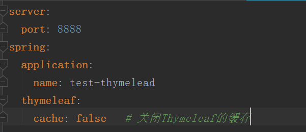

# Thymeleaf

　　

官网部分翻译：反正就是各种好

* Thymeleaf是用来开发Web和独立环境项目的服务器端的Java模版引擎
* Spring官方支持的服务的渲染模板中，并不包含jsp。而是Thymeleaf和Freemarker等，而Thymeleaf与SpringMVC的视图技术，及SpringBoot的自动化配置集成非常完美，几乎没有任何成本，你只用关注Thymeleaf的语法即可。


### Thymeleaf的特点

* 动静结合：Thymeleaf 在有网络和无网络的环境下皆可运行，即它可以让美工在浏览器查看页面的静态效果，也可以让程序员在服务器查看带数据的动态页面效果。这是由于它支持 html 原型，然后在 html 标签里增加额外的属性来达到模板+数据的展示方式。浏览器解释 html 时会忽略未定义的标签属性，所以 thymeleaf 的模板可以静态地运行；当有数据返回到页面时，Thymeleaf 标签会动态地替换掉静态内容，使页面动态显示。
* 开箱即用：它提供标准和spring标准两种方言，可以直接套用模板实现JSTL、 OGNL表达式效果，避免每天套模板、该jstl、改标签的困扰。同时开发人员也可以扩展和创建自定义的方言。
* 多方言支持：Thymeleaf 提供spring标准方言和一个与 SpringMVC 完美集成的可选模块，可以快速的实现表单绑定、属性编辑器、国际化等功能。
* 与SpringBoot完美整合，SpringBoot提供了Thymeleaf的默认配置，并且为Thymeleaf设置了视图解析器，我们可以像以前操作jsp一样来操作Thymeleaf。代码几乎没有任何区别，就是在模板语法上有区别。


### SpringBoot与之整合

我们创建一个SpringBoot项目，添加相关依赖，下面我们就可以入门吧

pom.xml

```xml
<dependencies>
        <dependency>
            <groupId>org.springframework.boot</groupId>
            <artifactId>spring-boot-starter-thymeleaf</artifactId>
        </dependency>
        <dependency>
            <groupId>org.springframework.boot</groupId>
            <artifactId>spring-boot-starter-web</artifactId>
        </dependency>
        <dependency>
            <groupId>org.springframework.boot</groupId>
            <artifactId>spring-boot-starter-test</artifactId>
        </dependency>
    </dependencies>
```

自动配置

自动给我们默认分配了模版的前缀和后缀，我们只需要按部就班的将模版丢进去即可

> 

我们写一个Controller：

> 

将返回的对应的模版添加到默认的位置下：

> 

编写配置文件application.yml：

> 

然后编写一个springBoot的启动类，这里不多说了，直接启动项目访问测试即可：

> 


## Thymeleaf常用语法

Thymeleaf的主要作用是把model中的数据渲染到html中，因此其语法主要是如何解析model中的数据。从以下方面来学习：

* 变量、方法、条件判断、循环、运算 [ 逻辑运算、布尔运算、比较运算、条件运算 ]
* 其它


### 变量_变量案列

我们先新建一个实体类：User

```java
public class User {
    String name;
    int age;
    User friend;// 对象类型属性
}
```

然后在模型中添加数据

```java
@GetMapping("test2")
public String test2(Model model){
    User user = new User();
    user.setAge(21);
    user.setName("Jackson");
    user.setFriend(new User("李小龙", 30));

    model.addAttribute("user", user);
    return "hello2";
}
```


> 语法说明：

Thymeleaf通过`${}`来获取model中的变量，注意这不是el表达式，而是ognl表达式，但是语法非常像。

> 示例：

我们在页面获取user数据：

```html
<h1>
    你好：<span th:text="${user.name}">请跟我来</span>
</h1>
```

感觉跟el表达式差不多的。区别在于，我们的表达式写在一个名为：`th:text`的标签属性中，这个叫做指令

### 变量_动静结合

> 指令：

Thymeleaf崇尚模板是纯正的html代码，脱离模板引擎，在纯静态环境也可以直接运行。现在如果我们直接在html中编写 `${}`这样的表达式，显然在静态环境下就会出错，这不符合Thymeleaf的理念。

Thymeleaf中所有的表达式都需要写在"指令"中，指令是HTML5中的自定义属性，在Thymeleaf中所有指令都是以`th:`开头。因为表达式`${user.name}`是写在自定义属性中，因此在静态环境下，表达式的内容会被当做是普通字符串，浏览器会自动忽略这些指令，这样就不会报错了。

如果我们不经过SpringMVC，而是直接用浏览器打开编写的页面：在静态环境下,`th`指令不会被识别，但是也不会报错，而是显示`<span>`标签的缺省默认值："请跟我来"

指令的设计，正是Thymeleaf的高明之处，也是它优于其它模板引擎的原因。动静结合的设计，使得无论是前端开发人员还是后端开发人员可以完美契合。

> 向下兼容

但是要注意，如果浏览器不支持Html5怎么办？

如果不支持这种`th:`的命名空间写法，那么可以把`th:text`换成 `data-th-text`，Thymeleaf也可以兼容。

> escape

另外，`th:text`指令出于安全考虑，会把表达式读取到的值进行处理，防止html的注入。

例如，`你好`将会被格式化输出为`$lt;p$gt;你好$lt;/p$lt;`。

如果想要不进行格式化输出，而是要输出原始内容，则使用`th:utext`来代替.


### 变量_ognl表达式的语法糖

刚才获取变量值，我们使用的是经典的`对象.属性名`方式。但有些情况下，我们的属性名可能本身也是变量，怎么办？

ognl提供了类似js的语法方式：

例如：`${user.name}` 可以写作`${user['name']}`


### 变量_自定义变量

> 场景

看下面的案例：

```html
<h2>
    <p>Name: <span th:text="${user.name}">Jack</span>.</p>
    <p>Age: <span th:text="${user.age}">21</span>.</p>
    <p>friend: <span th:text="${user.friend.name}">Rose</span>.</p>
</h2>
```

我们获取用户的所有信息，分别展示。

当数据量比较多的时候，频繁的写`user.`就会非常麻烦。

因此，Thymeleaf提供了自定义变量来解决：

> 示例：

```html
<h2 th:object="${user}">
    <p>Name: <span th:text="*{name}">Jack</span>.</p>
    <p>Age: <span th:text="*{age}">21</span>.</p>
    <p>friend: <span th:text="*{friend.name}">Rose</span>.</p>
</h2>
```

* 首先在 `h2`上 用 `th:object="${user}"`获取user的值，并且保存
* 然后，在`h2`内部的任意元素上，可以通过 `*{属性名}`的方式，来获取user中的属性，这样就省去了大量的`user.`前缀了


### 方法

> ognl表达式中的方法调用

ognl表达式本身就支持方法调用，例如：

```html
<h2 th:object="${user}">
    <p>FirstName: <span th:text="*{name.split(' ')[0]}">Jack</span>.</p>
    <p>LastName: <span th:text="*{name.split(' ')[1]}">Li</span>.</p>
</h2>
```

* 这里我们调用了name（是一个字符串）的split方法。

> Thymeleaf内置对象

Thymeleaf中提供了一些内置对象，并且在这些对象中提供了一些方法，方便我们来调用。获取这些对象，需要使用`#对象名`来引用。

* 一些环境相关对象

| 对象              | 作用                                          |
| ----------------- | --------------------------------------------- |
| `#ctx`            | 获取Thymeleaf自己的Context对象                |
| `#requset`        | 如果是web程序，可以获取HttpServletRequest对象 |
| `#response`       | 如果是web程序，可以获取HttpServletReponse对象 |
| `#session`        | 如果是web程序，可以获取HttpSession对象        |
| `#servletContext` | 如果是web程序，可以获取HttpServletContext对象 |
|                   |                                               |

* Thymeleaf提供的全局对象：

| 对象         | 作用                               |
| ------------ | ---------------------------------- |
| `#dates`     | 处理`java.util.date`的工具对象     |
| `#calendars` | 处理`java.util.calendar`的工具对象 |
| `#numbers`   | 用来对数字格式化的方法             |
| `#strings`   | 用来处理字符串的方法               |
| `#bools`     | 用来判断布尔值的方法               |
| `#arrays`    | 用来护理数组的方法                 |
| `#lists`     | 用来处理List集合的方法             |
| `#sets`      | 用来处理set集合的方法              |
| `#maps`      | 用来处理map集合的方法              |

* 举例

我们在环境变量中添加日期类型对象

```java
@GetMapping("test3")
public String show3(Model model){
    model.addAttribute("today", new Date());
    return "hello3";
}
```

在页面中处理

```html
<p>
  今天是: <span th:text="${#dates.format(today,'yyyy-MM-dd')}">2018-04-25</span>
</p>
```


### 方法_字面值

有的时候，我们需要在指令中填写基本类型如：字符串、数值、布尔等，并不希望被Thymeleaf解析为变量，这个时候称为字面值。

* 字符串字面值

  使用一对`'`引用的内容就是字符串字面值了：

  ```html
  <p>
    你正在观看 <span th:text="'thymeleaf'">template</span> 的字符串常量值.
  </p>
  ```

  `th:text`中的thymeleaf并不会被认为是变量，而是一个字符串

* 数字字面值

  数字不需要任何特殊语法， 写的什么就是什么，而且可以直接进行算术运算

  ```html
  <p>今年是 <span th:text="2018">1900</span>.</p>
  <p>两年后将会是 <span th:text="2018 + 2">1902</span>.</p>
  ```

* 布尔字面值

  布尔类型的字面值是true或false：

  ```html
  <div th:if="true">
      你填的是true
  </div>
  ```

  这里引用了一个`th:if`指令，跟vue中的`v-if`类似

### 方法_拼接

我们经常会用到普通字符串与表达式拼接的情况：

```html
<span th:text="'欢迎您:' + ${user.name} + '!'"></span>
```

字符串字面值需要用`''`，拼接起来非常麻烦，Thymeleaf对此进行了简化，使用一对`|`即可：

```html
<span th:text="|欢迎您:${user.name}|"></span>
```

### 运算

需要注意：`${}`内部的是通过OGNL表达式引擎解析的，外部的才是通过Thymeleaf的引擎解析，因此运算符尽量放在`${}`外进行。

* 算术运算

  支持的算术运算符：`+ - * / %`

  ```html
  <span th:text="${user.age}"></span>         //21
  <span th:text="${user.age}%2 == 0"></span>  //false
  ```

* 比较运算

  支持的比较运算：`>`, `<`, `>=` and `<=` ，但是`>`, `<`不能直接使用，因为xml会解析为标签，要使用别名。

  注意 `==` and `!=`不仅可以比较数值，类似于equals的功能。

  可以使用的别名：`gt (>), lt (<), ge (>=), le (<=), not (!). Also eq (==), neq/ne (!=).`

* 条件运算

  * 三元运算

  ```html
  <span th:text="${user.sex} ? '男':'女'"></span>
  ```

  * 默认值

    有的时候，我们取一个值可能为空，这个时候需要做非空判断，可以使用 `表达式 ?: 默认值`简写：

  ```html
  <span th:text="${user.name} ?: '二狗'"></span>
  ```

  当前面的表达式值为null时，就会使用后面的默认值。

  注意：`?:`之间没有空格。

### 循环

循环也是非常频繁使用的需求，我们使用`th:each`指令来完成：

假如有用户的集合：users在Context中。

```html
<tr th:each="user : ${users}">
    <td th:text="${user.name}">Onions</td>
    <td th:text="${user.age}">2.41</td>
</tr>
```

* ${users} 是要遍历的集合，可以是以下类型：
  * Iterable，实现了Iterable接口的类
  * Enumeration，枚举
  * Interator，迭代器
  * Map，遍历得到的是Map.Entry
  * Array，数组及其它一切符合数组结果的对象

在迭代的同时，我们也可以获取迭代的状态对象：

```html
<tr th:each="user,stat : ${users}">
    <td th:text="${user.name}">Onions</td>
    <td th:text="${user.age}">2.41</td>
</tr>
```

stat对象包含以下属性：

* `index`，从0开始的角标
* `count`，元素的个数，从1开始
* `size`，总元素个数
* `current`，当前遍历到的元素
* `even`/``odd`，返回是否为奇偶，boolean值
* `first`/`last`，返回是否为第一或最后，boolean值

### 逻辑判断

有了`if`和`else`，我们能实现一切功能\^_\^。

Thymeleaf中使用`th:if` 或者 `th:unless` ，两者的意思恰好相反。

```html
<span th:if="${user.age} > 24">老油条</span>
```

如果表达式的值为`true`，则标签会渲染到页面，否则不进行渲染。

以下情况被认定为`true`：

* 表达式值为true
* 表达式值为非0数值
* 表达式值为非0字符
* 表达式值为字符串，但不是`"false"`,`"no"`,`"off"`
* 表达式不是布尔、字符串、数字、字符中的任何一种

其它情况包括`null`都被认定为`false`


### 分支控制switch

这里要使用两个指令：`th:switch` 和 `th:case`

```html
<div th:switch="${user.role}">
  <p th:case="'admin'">用户是管理员</p>
  <p th:case="'manager'">用户是经理</p>
  <p th:case="*">用户是别的玩意</p>
</div>
```

需要注意的是，一旦有一个`th:case`成立，其它的则不再判断。与java中的`switch`是一样的。

另外`th:case="*"`表示默认，放最后。


### JS模板

模板引擎不仅可以渲染html，也可以对JS中的进行预处理。而且为了在纯静态环境下可以运行，其Thymeleaf代码可以被注释起来：

```html
<script th:inline="javascript">
    const user = /*[[${user}]]*/ {};
    const age = /*[[${user.age}]]*/ 20;
    console.log(user);
    console.log(age)
</script>
```

* 在script标签中通过`th:inline="javascript"`来声明这是要特殊处理的js脚本

* 语法结构：

  ```javascript
  const user = /*[[Thymeleaf表达式]]*/ "静态环境下的默认值";
  ```

  因为Thymeleaf被注释起来，因此即便是静态环境下， js代码也不会报错，而是采用表达式后面跟着的默认值。且User对象会被直接处理为`json`格式。